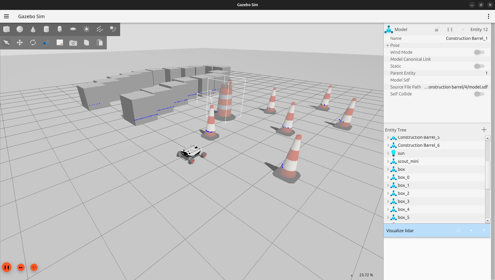

# Desafio ROS2 Verlab 2025/1

- [Desafio ROS2 Verlab 2025/1](#desafio-ros2-verlab-20251)
  - [Description](#description)
  - [How to Run the Project](#how-to-run-the-project)
    - [Prerequisites](#prerequisites)
    - [Setup Instructions](#setup-instructions)
    - [Running the Project](#running-the-project)
  - [Working project video](#working-project-video)
  - [Acknowledgments](#acknowledgments)


## Description

This project is a ROS2 simulation of the AgileX Scout Mini robot, designed to navigate and avoid obstacles using a Lidar sensor.  
The simulation is built using Gazebo and Rviz and includes a Wall Avoidance System (WAS) that ensures the robot can autonomously avoid collisions.

## How to Run the Project

### Prerequisites
Ensure you have the following installed:
- ROS 2 (Jazzy)
- Gazebo
- colcon

### Setup Instructions

1. **Clone the repository:**
    ```bash
    git clone https://github.com/PolloHacker/desafio_ros2_verlab_2025.1.git
    cd desafio_ros2_verlab_2025.1
    ```

3. **Install dependencies:**
    ```bash
    rosdep install --from-paths src --rosdistro jazzy -y
    ```

4. **Build the workspace:**
    ```bash
    colcon build
    ```

5. **Source the workspace:**
    ```bash
    source install/setup.bash
    ```

### Running the Project

1. **Launch the simulation:**
    ```bash
    ros2 launch scout_gazebo_sim scout_mini_test_world.launch.py
    ```

2. **Control the robot:**  
    - Using the 3D Wall Avoidance System (WAS3):
    
        ```bash
        ros2 run teleop_twist_keyboard teleop_twist_keyboard --ros-args -r cmd_vel:=scout_mini/cmd_vel
        ```
        After that, start the wall avoidance system:

        ```bash
        ros2 run scout_avoid_walls_3d avoid_walls
        ```

        It will make sure the robot doesn't crash into an obstacle by reading key commands from keyboard and deciding when to turn and stop.

    - Just control the scout normally:
    
        ```bash
        ros2 run teleop_twist_keyboard teleop_twist_keyboard --ros-args -r cmd_vel:=scout_mini/cmd_vel_safe
        ```

        Here, we pass keyboard commands directly where the scout reads the "safe" data WAS sends.

## Working project video

[](https://www.youtube.com/watch?v=IpDZvR9JGFU)

## Acknowledgments

Big thanks to all the repos and tutorials that helped me go through this challenge:

- [Scout Mini user manual](https://www.generationrobots.com/media/agilex/SCOUT_MINI_UserManual_v1.0.1_EN.pdf)
- [Official Manufactorer docs](https://global.agilex.ai/products/scout-mini)
- [Diff drive robot](https://github.com/adoodevv/diff_drive_robot)
- [Official Gazebo tutorials](https://gazebosim.org/docs/latest/sensors/#lidar-sensor)
- [Official ROS2 docs](https://docs.ros.org/en/jazzy/index.html)
- [Scout Mini model for Gazebo in ROS2](https://github.com/mattiadutto/ugv_gazebo_sim)
- [Agilex models for Gazebo](https://github.com/agilexrobotics/ugv_gazebo_sim)
- [Kevin Wood | Robotics & AI channel](https://www.youtube.com/@kevinwoodrobotics)
- [Acceleration Robotics repo](https://github.com/acceleration-robotics/ros2-igt)
- [Wikipedia article about inertia](https://en.wikipedia.org/wiki/List_of_moments_of_inertia#List_of_3D_inertia_tensors)
- To all Stack Overflow, Reddit and ROS Answers topics that helped me fix broken parts of the project
